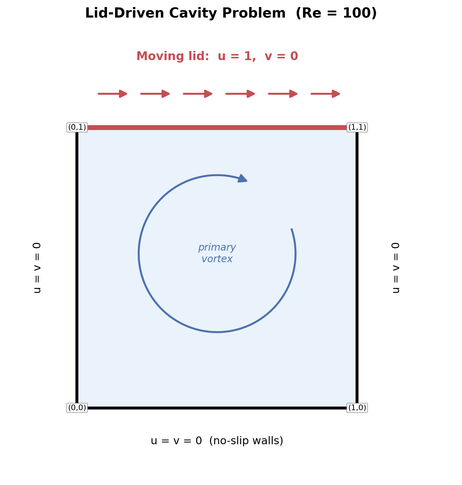
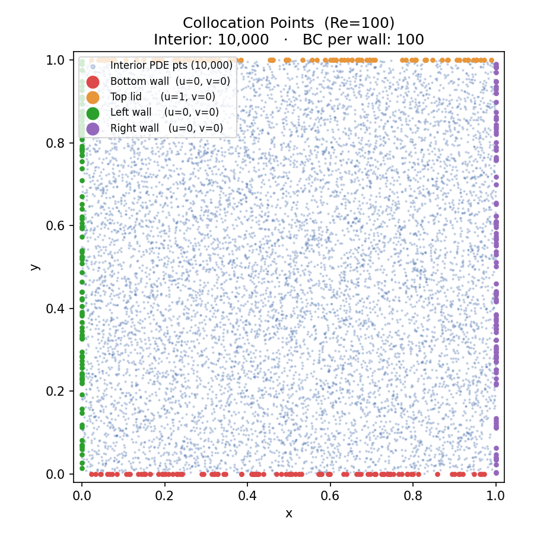
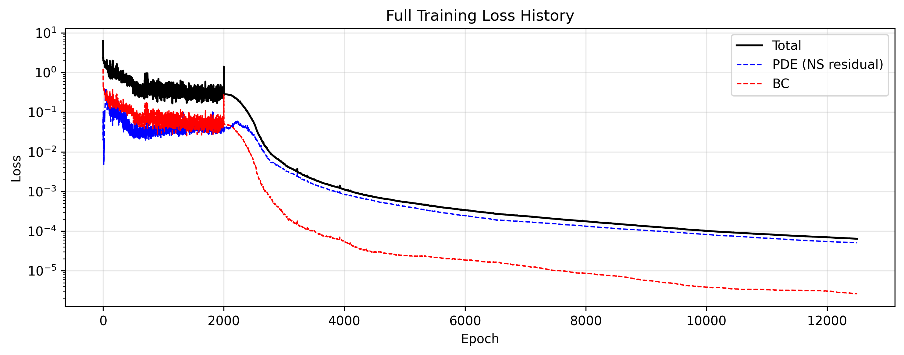
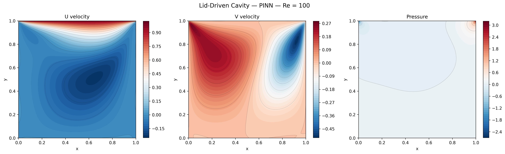
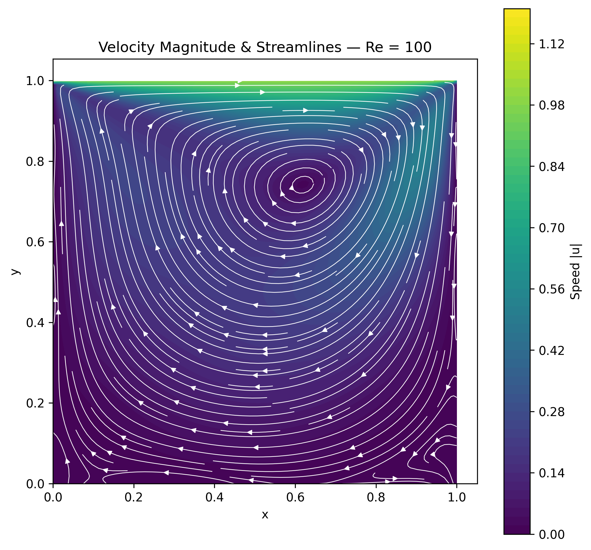
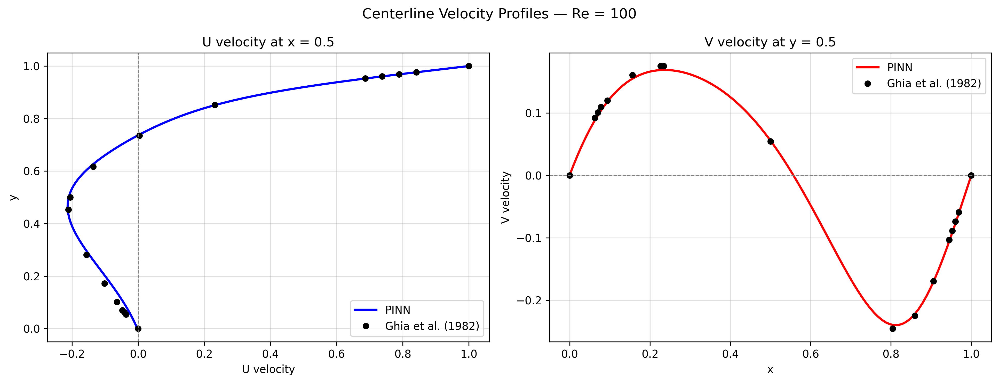

# PINN — Steady 2D Lid-Driven Cavity

A Physics-Informed Neural Network (PINN) that solves the steady 2D incompressible Navier-Stokes equations for the lid-driven cavity problem.

## Problem

The unit square domain [0,1]x[0,1] with a moving lid on the top wall:

- **Top wall** (y=1): u=1, v=0 (moving lid)
- **All other walls**: u=0, v=0 (no-slip)

<p align="center">
  
</p>

Governing equations:
```
Continuity:   ∂u/∂x + ∂v/∂y = 0
x-momentum:   u·∂u/∂x + v·∂u/∂y = -∂p/∂x + (1/Re)(∂²u/∂x² + ∂²u/∂y²)
y-momentum:   u·∂v/∂x + v·∂v/∂y = -∂p/∂y + (1/Re)(∂²v/∂x² + ∂²v/∂y²)
```

## Method

The network takes (x, y) as input and outputs (u, v, p). It is trained by minimizing:

- **PDE loss** — Navier-Stokes residuals at 10,000 random interior collocation points
- **BC loss** — boundary condition mismatch at 100 points per wall

Training uses **Adam** followed by **L-BFGS** fine-tuning (quasi-Newton) to drive the PDE residual lower after Adam plateaus.

## Network Architecture

| Parameter | Value |
|-----------|-------|
| Input | (x, y) |
| Output | (u, v, p) |
| Hidden layers | 8 |
| Units per layer | 64 |
| Activation | Tanh |
| Initialization | Xavier normal |

## Key Parameters

| Parameter | Value |
|-----------|-------|
| Re | 100 |
| Adam epochs | 2,000 |
| Interior points | 10,000 |
| BC points per wall | 100 |
| BC weight | 5.0 |
| Learning rate | 1e-3 (exponential decay γ=0.9997) |
| L-BFGS max iter | 10,000 |

## Output Files

| File | Description |
|------|-------------|
| `collocation_points.png` | Interior PDE points + boundary points |
> <p align="center">
  
</p>
| `final_loss.png` | Full training loss history (Adam + L-BFGS) |
> <p align="center">
  
</p>
| `cavity_contours.png` | U, V, P contour maps |
> <p align="center">
  
</p>
| `streamlines.png` | Velocity magnitude + streamlines |
> <p align="center">
  
</p>

## Validation

Results are compared against:

> Ghia, U., Ghia, K. N., & Shin, C. T. (1982). High-Re solutions for incompressible flow using the Navier-Stokes equations and a multigrid method. *Journal of Computational Physics*, 48(3), 387–411.
>
> <p align="center">
  
</p>

## Requirements

```
torch
numpy
matplotlib
```

## Usage

```bash
python pinn_lid_driven_cavity.py
```
